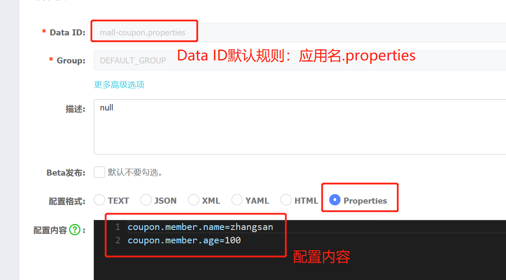
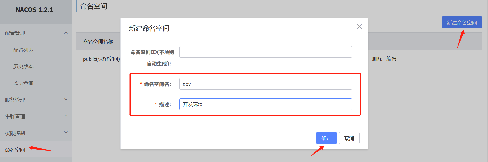
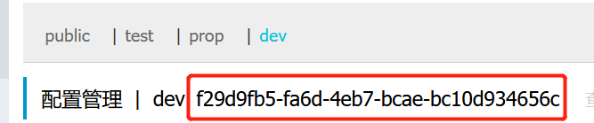
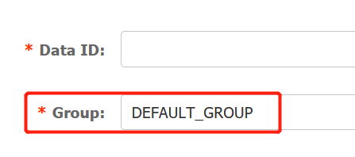
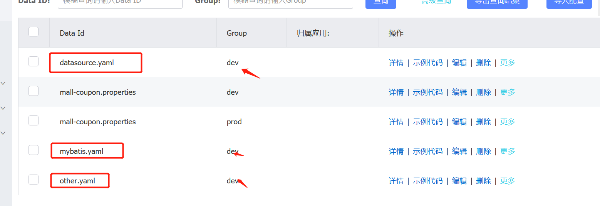
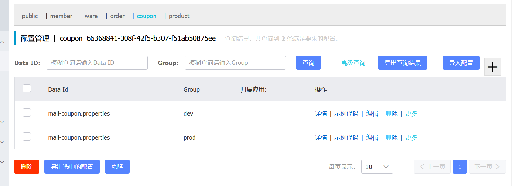

## 逆向工程

[开源项目：逆向工程—①键完成CRUD](https://gitee.com/renrenio/renren-generator?_from=gitee_search)

### 整合mybatis-plus

1. 导入依赖

    ```xml
    <dependency>
        <groupId>com.baomidou</groupId>
        <artifactId>mybatis-plus-boot-starter</artifactId>
        <version>3.2.0</version>
    </dependency>
    ```

2. 配置（参考官方文档）

    - 配置数据源

        - 导入数据库驱动

            ```xml
            <dependency>
                <groupId>mysql</groupId>
                <artifactId>mysql-connector-java</artifactId>
                <version>8.0.18</version>
            </dependency>
            ```

        - 配置数据源

            ```
            driver-class-name: com.mysql.cj.jdbc.Driver
            url: jdbc:mysql://192.168.110.135:3306/aimerrhythms_mall_admin?useUnicode=true&characterEncoding=UTF-8&serverTimezone=Asia/Shanghai&useSSL=false
            username: root
            password: 123123
            ```

    - 配置mybatis-plus

        - @MapperScan("com.aimerrhythms.mall.product.dao")。  扫描dao层接口

        - 在yaml文件中告诉mybatis-plus，dao接口的SQL映射文件的位置

            ```yaml
            # classpath*中的*表示引用的其他jar包下的类路径也进行扫描
            # 一般写classpath即可
            mybatis-plus:
              mapper-locations: classpath:/mapper/**/*.xml
            # mapper-locations: classpath*:/mapper/**/*.xml
            ```

        - 配置文件中调整主键的自增（mybatis-plus的机制）

            ```yaml
            mybatis-plus:
              global-config:
                db-config:
                  id-type: auto
            ```

## Spring Cloud Alibaba最终技术搭配方案

[Spring Cloud Alibaba](https://github.com/alibaba/spring-cloud-alibaba/blob/master/README-zh.md)

1、Spring Cloud Alibaba - Nacos：注册中心（服务发现/注册）

2、Spring Cloud Alibaba - Nacos：配置中心（动态配置管理）

3、Spring Cloud - Ribbon：负载均衡

4、Spring Cloud - Feign：声明式HTTP客户端（调用远程服务）

5、Spring Cloud Alibaba - Sentinel：服务容错（限流、降级、熔断）

6、Spring Cloud - GateWay：API网关（webflux 编程模式）

7、Spring Cloud - Sleuth：调用链监控

8、Spring Cloud Alibaba - Seated：原Fescar，分布式事务解决方案

### 一、Nacos作为注册中心注册/发现服务

[nacos-discovery-example](https://github.com/alibaba/spring-cloud-alibaba/blob/master/spring-cloud-alibaba-examples/nacos-example/nacos-discovery-example/readme-zh.md)

1. 下载[Nacos Server](https://github.com/alibaba/nacos/releases)；启动(nacos/bin/startup.cmd)；访问localhost:8848/nacos/；使用默认账号登录（账号密码默认nacos）。

2. 首选pom.xml中引入Spring Cloud Alibaba的版本控制依赖

    ```xml
    <dependencyManagement>
        <dependencies>
            <dependency>
                <groupId>com.alibaba.cloud</groupId>
                <artifactId>spring-cloud-alibaba-dependencies</artifactId>
                <version>2.2.0.RELEASE</version>
                <type>pom</type>
                <scope>import</scope>
            </dependency>
        </dependencies>
    </dependencyManagement>
    ```

3. 引入Nacos Discovery Starter

    ```xml
    <dependency>
        <groupId>com.alibaba.cloud</groupId>
        <artifactId>spring-cloud-starter-alibaba-nacos-discovery</artifactId>
    </dependency>
    ```

4. 微服务配置文件中配置Nacos Server地址和服务名

    ```yaml
    spring:
      cloud:
        nacos:
          discovery:
            server-addr: 127.0.0.1:8848
      application:
        name: mall-coupon
    ```

5. 启动类上使用`@EnableDiscoveryClient`注解开启服务注册/发现功能

### 二、服务之间的声明式远程调用：Feign

1. 引入依赖

    ```xml
    <dependency>
        <groupId>org.springframework.cloud</groupId>
        <artifactId>spring-cloud-starter-openfeign</artifactId>
    </dependency>
    ```

2. 声明远程接口，这个接口需要调用远程服务

    ```java
    package com.aimerrhythms.mall.member.feign;
    
    import com.aimerrhythms.common.utils.R;
    import org.springframework.cloud.openfeign.FeignClient;
    import org.springframework.web.bind.annotation.RequestMapping;
    
    /**
     * 这个接口是需要调用远程服务的
     *
     * 声明接口中的每一个方法都是需要调用的远程服务的相应的请求
     * @author aimerrhythms
     * @data 2020/5/29 15:27
     */
    @FeignClient("mall-coupon")  //声明这个接口中的方法需要调用哪个远程服务
    public interface CouponFeignService {
    
        @RequestMapping("/coupon/coupon/member/list")  //声明这个方法需要调用远程服务的哪个请求
        R memberCoupons();
    
    }
    ```

3. 启动类使用注解：`@EnableFeignClients(basePackages = "远程调用接口的全限定包名")`开启Feign功能

4. controller层编写代码，调用远程服务

    ```java
    @Autowired
    private CouponFeignService couponFeignService;
    
    @RequestMapping("/coupons")
    public R test() {
        MemberEntity memberEntity = new MemberEntity();
        memberEntity.setNickname("aimerrhythms");
        R r = couponFeignService.memberCoupons();
        return R.ok().put("member", memberEntity).put("coupons", r.get("coupons"));
    }
    ```

5. 远程调用的逻辑：A服务调用B服务

    - B服务controller层提供A需要调用的请求方法
    - A服务编写远程调用接口
    - A服务启动类配置@EnableFeignClients(basePackages = "..")注解表名开启远程调用功能，并配置扫描的远程调用接口包名
    - A服务在controller层注入远程调用接口对象，然后编写方法，调用接口对象提供的方法，进行远程调用B服务相应的方法

### 三、Naocs作为配置中心集中管理微服务的配置

[Nacos Config Example](https://github.com/alibaba/spring-cloud-alibaba/blob/master/spring-cloud-alibaba-examples/nacos-example/nacos-config-example/readme-zh.md)

1. 引入依赖

    ```xml
    <!--Spring Cloud Alibaba Nacos Config-->
    <dependency>
        <groupId>com.alibaba.cloud</groupId>
        <artifactId>spring-cloud-starter-alibaba-nacos-config</artifactId>
    </dependency>
    ```

2. 创建bootstrap.properties配置文件，并添加以下配置

    ```properties
    # 优于application.yaml配置文件先执行
    spring.cloud.nacos.config.server-addr=127.0.0.1:8848
    spring.application.name=mall-coupon
    ```

3. 在Nacos后端管理界面，给配置中心默认添加一个**`当前应用名.properties`**的配置集

4. 给该配置集中添加随意的配置

5. 动态获取配置

    - 动态刷新配置：@RefreshScope 
    - 获取某个配置的值：@Value("${key}")

6. 配置中心和当前应用的配置文件中都配置了相同的项，优先使用配置中心的配置。

7. 并且项目中可以不用再配置相同的属性，项目启动的时候也是直接去配置中心中找相应的配置



### 四、Nacos作为配置中心的其他细节

1. 命名空间

    - 用做配置隔离

    - **默认**所有配置都在**public**空间下

    - 1、开发、测试、生成等**不同环境**下有不同的配置。那么就可以创建不同的**命名空间**用于**隔离不同环境下的配置**

        - 新增命名空间

            

        - 不同的命名空间起到了配置隔离的效果。不同的命名空间**指定或者随机生成**一个**命名空间ID**

            

        - 在bootstrap.properties文件中添加该项目使用哪个命名空间的配置文件

            ```properties
            # 必须使用命名空间ID
            spring.cloud.nacos.config.namespace=f29d9fb5-fa6d-4eb7-bcae-bc10d934656c
            ```

    - 2、**不同微服务**也可以有不同的命名空间用于隔离配置。

        - 即为每个微服务创建不同的命名空间
        - 但是两者不能兼顾。需要根据业务特性进行分配

2. 配置集：一组相关或者不相关的**配置项**的集合称为配置集

    - 配置项：比如数据源、线程池、日记级别等就是一个配置项
    - 所以通常一个配置文件就是一个配置集

3. 配置集ID：类似于配置文件名

    - 其实就是Data ID

4. 配置分组

    - 默认所有的配置集都属于DEFAULT_GROUP

    - 在创建配置集的时候就可以指定不同的配置分组

        

    - 然后再`bootstrap.properties`配置文件中指定配置分组，不写的话默认分组

        ```properties
        spring.cloud.nacos.config.group=分组名
        ```

5. 加载多个配置文件：可以把`application.yaml`中的配置内容分开

    - 微服务任何配置文件都可以放在配置中心中

    - 提取相同类型的配置项

        

    - 然后修改`bootstrap.yaml`中的配置内容。声明加载哪些配置文件即可

        ```yaml
        # 优于application.yaml配置文件先执行
        spring:
          application:
            name: mall-coupon
          cloud:
            nacos:
              config:
                server-addr: 127.0.0.1:8848
                namespace: 66368841-008f-42f5-b307-f51ab50875ee
                extension-configs:
                  # 一个对象相当于加载了一个配置文件
                  - dataId: datasource.yaml
                    group: dev
                    refresh: true # 动态刷新
        
                  - dataId: mybatis.yaml
                    group: dev
                    refresh: true
        
                  - dataId: other.yaml
                    group: dev
                    refresh: true
        
                  # 不写的话，加载默认分组的配置文件。如果没有默认分组，则加载项目中的配置文件
                  - dataId: mall-coupon.properties
                    group: dev
                    refresh: true
        ```

    - 以前SpringBoot从配置文件中获取属性的方式：@Value、@ConfigurationProperties都能从配置中心中获取。并且**优先使用配置中心的内容**

6. 本项目中规定：

    - 每个微服务创建自己的命名空间

    - 使用配置分组区分dev、test、prod

        

### 五、网关核心概念和原理

1、简介

**网关是流量的入口**。常用功能包括：路由转发、权限校验、限流控制等。

2、Glossary

- Route：路由
    - 它是路由的gateway模块的基础组成。它是由ID、目标URI、一系列的**断言**和一系列的**过滤器**组成。当。如果断言为true，则对请求匹配路由
- Predicate：断言
    - 它是Java8提供的一种断言函数。函数的输入是一个Spring框架提供了`ServerWebExchange`对象。他可以匹配HTTP请求中的所有内容
- Filter：过滤器
    - 它是一些列由Spring工厂构建的GateWayFilter实例对象。这些对象可以在请求达到服务器之前和服务器响应之后进行修改


3、配置

```yaml
# application.yaml
spring:
  cloud:
    nacos:
      discovery:
        server-addr: 127.0.0.1:8848
    gateway:
      routes:
        - id: baidu_route
          uri: https://www.baidu.com
          predicates:
            - Query=url,baidu

        - id: qq_route
          uri: https://www.qq.com
          predicates:
            - Query=url,qq


# bootstrap.yaml
spring:
  cloud:
    nacos:
      config:
        server-addr: 127.0.0.1:8848
        namespace: gateway
        group: dev


# 注意：本项目中需要在gateway模块的启动项中排除mybatis的自动配置类
# 因为模块依赖了common模块，因此也加入了mybatis-plus的启动器依赖。所以再在动的时候会去连接数据库
# 如果没有配置数据源的话，就会启动报错
```

